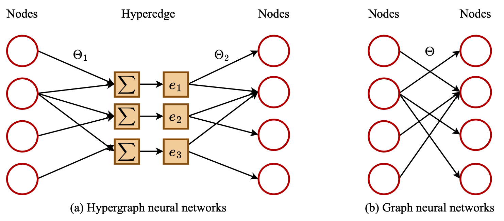
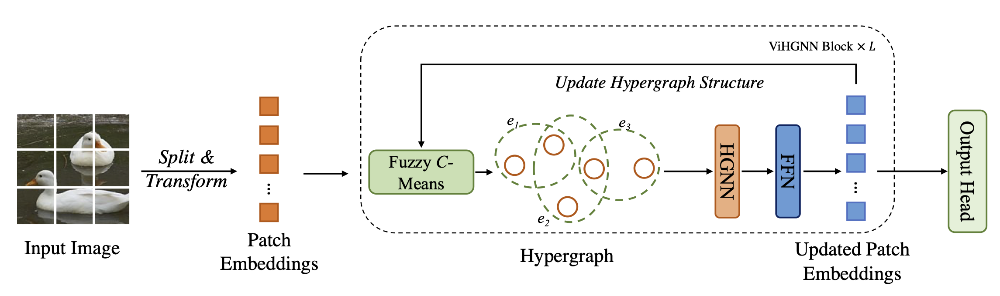

# [ICCV2023] Vision HGNN: An Image is More than a Graph of Nodes
By Yan Han, Peihao Wang, Souvik Kundu, Ying Ding and Zhangyang Wang.




## Requirements
Pytorch 1.7.0,
timm 0.3.2,
torchprofile 0.0.4,
apex

## ViHGNN Code
Paper: [Vision HGNN: An Image is More than a Graph of Nodes](https://openaccess.thecvf.com/content/ICCV2023/papers/Han_Vision_HGNN_An_Image_is_More_than_a_Graph_of_ICCV_2023_paper.pdf)

## Training
- Training ViHGNN for 8 GPUs:
```
python -m torch.distributed.launch --nproc_per_node=8 train.py /path/to/imagenet/ --model vihg_ti_224_gelu --sched cosine --epochs 300 --opt adamw -j 8 --warmup-lr 1e-6 --mixup .8 --cutmix 1.0 --model-ema --model-ema-decay 0.99996 --aa rand-m9-mstd0.5-inc1 --color-jitter 0.4 --warmup-epochs 20 --opt-eps 1e-8 --repeated-aug --remode pixel --reprob 0.25 --amp --lr 2e-3 --weight-decay .05 --drop 0 --drop-path .1 -b 128 --output /path/to/save/models/
```
- Training Pyramid ViHGNN for 8 GPUs:
```
python -m torch.distributed.launch --nproc_per_node=8 train.py /path/to/imagenet/ --model pvihg_ti_224_gelu --sched cosine --epochs 300 --opt adamw -j 8 --warmup-lr 1e-6 --mixup .8 --cutmix 1.0 --model-ema --model-ema-decay 0.99996 --aa rand-m9-mstd0.5-inc1 --color-jitter 0.4 --warmup-epochs 20 --opt-eps 1e-8 --repeated-aug --remode pixel --reprob 0.25 --amp --lr 2e-3 --weight-decay .05 --drop 0 --drop-path .1 -b 128 --output /path/to/save/models/
```

## Evaluation
- Evaluate example:
```
python train.py /path/to/imagenet/ --model pvihg_ti_224_gelu -b 128 --pretrain_path /path/to/pretrained/model/ --evaluate
```

## Citation
```
@InProceedings{Han_2023_ICCV,
    author    = {Han, Yan and Wang, Peihao and Kundu, Souvik and Ding, Ying and Wang, Zhangyang},
    title     = {Vision HGNN: An Image is More than a Graph of Nodes},
    booktitle = {Proceedings of the IEEE/CVF International Conference on Computer Vision (ICCV)},
    month     = {October},
    year      = {2023},
    pages     = {19878-19888}
}
```
## Acknowledgement
This repo partially uses code from [deep_gcns_torch](https://github.com/lightaime/deep_gcns_torch), [timm](https://github.com/rwightman/pytorch-image-models) and [ViG](https://github.com/huawei-noah/Efficient-AI-Backbones/tree/master/vig_pytorch).